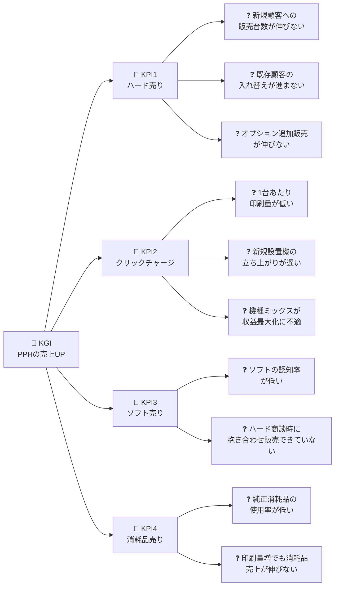

# ロジックツリー解答例：PPHの売上を上げたい

研修1日目PMのビジネス理解ワーク用の解答例。
**まだデータを見ていない段階** で、ビジネス視点から「PPH売上を上げるには？」を分解する。
**KGI → KPI → 問題 → 原因 → 数値KPI（指標案）→ 解決策** の構造。

## 凡例

| 記号 | 意味 |
| --- | --- |
| 🎯 KGI | 最終的に達成したいゴール |
| 📌 KPI | KGI 達成のための中間指標 |
| ❓ 問題 | 起こっている事象 |
| ⚠ 原因 | なぜその問題が起きているか |
| 📊 数値KPI | 数値で測りたい指標（具体的なデータ列は問わない、ビジネスKPI） |
| 💡 解決策 | 施策案（研修ゴールの「○○の施策」に該当） |

---

## ツリー全体像



---

## 🎯 KGI：コニカミノルタのPPHの売上を上げたい

PPH事業の総売上＝ ハード売上 ＋ ソフト売上 ＋ 消耗品売上 ＋ クリックチャージ収入

本ロジックツリーでは4つすべてを分解する。
特に **ハード売り** と **クリックチャージ** を厚く、**ソフト売り** と **消耗品売り** は例として2問題ずつ。

---

## 📌 KPI1：ハード（本体・オプション）を売り上げたい

### ❓ 問題1-1：新規顧客への販売台数が伸びない地域がある

- ⚠ **原因**：
  - 地域ごとに製品ラインナップの浸透度が異なる
  - 市場規模に対して販売リソースが不足している
  - 競合との差別化が伝わっていない
- 📊 **数値KPI**：
  - 地域別・機種別 年間販売台数
  - 国別 人口・GDP 比でみた設置密度
  - 地域別シェア率
- 💡 **解決策**：
  - 🟢 **現場感覚で打てる**：販売実績の少ない地域にデモ機投入・販社向け勉強会
  - 🟡 **データ分析で深掘り**：「地域特性 × 機種スペック」から **販売されやすい機種を分類予測**、新規地域への投入機種を選定
  - 🔵 **将来データが揃えば**：過去N年の年次販売実績で時系列予測 → 「来年X台売れる見込み」の根拠ある営業計画

### ❓ 問題1-2：既存顧客の入れ替え販売（リプレイス）が進まない

- ⚠ **原因**：
  - 顧客が現状機種で十分と感じている
  - 印刷量が多いのにエントリー機を使い続けている顧客がいる
  - リプレイスのタイミング判断が営業の感覚頼みになっている
- 📊 **数値KPI**：
  - リプレイス成功件数／年
  - 顧客の月間印刷量 vs 機種のスペック処理量（オーバースペック率）
  - 同機種内で印刷量が上位X%の顧客数
- 💡 **解決策**：
  - 🟢 **現場感覚で打てる**：月間印刷量が多い顧客を抽出して上位機を提案
  - 🟡 **データ分析で深掘り**：「印刷量 × 顧客特性」から **最適な機種クラスを予測**。「この顧客には本来このクラスの機械が合っている」を自動推定して提案リスト化
  - 🔵 **将来データが揃えば**：顧客の月次印刷量推移から **印刷量が増加トレンドの顧客** を検知、アップグレード提案の最適タイミングを見逃さない

### ❓ 問題1-3：オプション追加販売が伸びない

- ⚠ **原因**：
  - 顧客が高機能オプションの活用方法を知らない
  - 同機種なのに搭載オプションに差がある＝売れ残っている機体がある
  - オプションの存在自体が認知されていない
- 📊 **数値KPI**：
  - 機種別 オプション搭載率
  - 顧客あたり平均オプション数
  - 高機能フィニッシャーの搭載率
- 💡 **解決策**：
  - 🟢 **現場感覚で打てる**：オプション搭載数が少ない機体を抽出して活用デモ
  - 🟡 **データ分析で深掘り**：オプション構成パターンをクラスタリングし、**典型構成から外れた機体** を発見。「同機種・同地域は通常Yを搭載 → この顧客にもY」のレコメンド
  - 🔵 **将来データが揃えば**：印刷ジョブ内訳データ（カラー/モノクロ・両面・用紙種・仕上げ）で **業務とオプションのミスマッチを直接検出**

---

## 📌 KPI2：クリックチャージを増やしたい

### ❓ 問題2-1：1台あたりの月間印刷量が予測値より低い機体が多い

- ⚠ **原因**：
  - 同等構成の他機体に比べて使われていない（休眠／教育不足／ワークフロー未統合 等）
  - 顧客が印刷ニーズを内製化していない（外注に出している）
  - 設置後のフォローが不十分
- 📊 **数値KPI**：
  - 1台あたり月間印刷枚数（実測 vs 期待値）
  - 同等構成機体間の印刷量のばらつき
  - 低稼働機体の比率
- 💡 **解決策**：
  - 🟢 **現場感覚で打てる**：機種別の平均印刷量と比較して大きく下回る顧客に訪問稼働支援
  - 🟡 **データ分析で深掘り**：教師あり学習で「機種・地域・オプション構成」から **本来の標準印刷量を予測** → 予測より低い機体を抽出。さらに教師なし学習で **低稼働の原因タイプ別**（故障／教育不足／ワークフロー未統合／業務量小）に分類してタイプ別施策
  - 🔵 **将来データが揃えば**：サービスコール履歴で「故障で止まっている機体」を除外、月次データで離反予兆検知

### ❓ 問題2-2：新規設置機の立ち上がりが遅い

- ⚠ **原因**：
  - 設置直後はオペレータが機械に慣れていない
  - 旧機との並列運用期間が長い
  - フォロー訪問の体制が機種・地域でばらつく
- 📊 **数値KPI**：
  - 設置後N ヶ月時点の月間印刷量
  - 立ち上がり期間（フル稼働到達までの月数）
  - 新規設置機の月別印刷量カーブ
- 💡 **解決策**：
  - 🟢 **現場感覚で打てる**：設置後3ヶ月以内のフォロー訪問を必須化
  - 🟡 **データ分析で深掘り**：顧客属性×機種×オプション構成から **「N ヶ月後に到達するはずの印刷量」を予測**、実測がそれより低い機体を早期発見してフォロー
  - 🔵 **将来データが揃えば**：設置日付＋月次印刷量で **立ち上がりカーブを機種別・顧客タイプ別にモデル化**、設置時点で「立ち上がりが遅いタイプ」を予測して初期から伴走

### ❓ 問題2-3：機種ミックスがクリック収益最大化に適していない

- ⚠ **原因**：
  - 顧客の印刷量に対して、低速・低価格機を多数並べているケースがある
  - 高クリック収益機種（プロダクション機）の比率が低い地域がある
  - 営業が「売れやすい機種」中心に提案している
- 📊 **数値KPI**：
  - 機種別 1台あたり年間クリック収益
  - 地域別 機種構成（プロダクション機の比率）
  - センター内の機種ポートフォリオの最適化余地
- 💡 **解決策**：
  - 🟢 **現場感覚で打てる**：複数台運用している顧客に集約提案（複数の中型機 → 1台の大型機）／プロダクション機シェアの低い地域への重点販売
  - 🟡 **データ分析で深掘り**：教師あり学習で **「最適な機種構成（ポートフォリオ）」をシミュレーション**。「現状の月間印刷量を捌くのに本来は機種AをM台＋機種BをK台が最適」を提示
  - 🔵 **将来データが揃えば**：競合シェア・市場規模データで **シェア奪取の余地** を地域×機種で定量化、過去の置換実績から成功率も予測

---

## 📌 KPI3：ソフト（Flux・jobmanager 等）を売り上げたい

### ❓ 問題3-1：ソフトの認知率が低い

- ⚠ **原因**：
  - ハード営業がソフト商品の説明スキルを持っていない
  - 顧客がソフトでできることをイメージできていない
  - パンフレット・サイトでの訴求が弱い
- 📊 **数値KPI**：
  - ハード新規契約に占めるソフト同時契約率
  - 既存ハード顧客のソフト導入率
  - ソフトの製品サイトのアクセス数
- 💡 **解決策**：
  - 🟢 **現場感覚で打てる**：販社向けのソフト製品勉強会、デモ環境の整備
  - 🟡 **データ分析で深掘り**：「ソフト導入済み顧客」と「未導入顧客」の特徴比較から **導入される確率が高い顧客像** を特定し、優先アプローチリストを生成
  - 🔵 **将来データが揃えば**：顧客のソフト試用ログ・サイト閲覧ログが取れれば、**興味を示している顧客** を検出してリアルタイム営業

### ❓ 問題3-2：ハード商談時に抱き合わせ販売できていない

- ⚠ **原因**：
  - 商談プロセスでソフト提案が抜けている
  - ハードの納期を優先してソフト商談を後回しにしている
  - ソフトの価値が顧客の業務改善イメージに繋がっていない
- 📊 **数値KPI**：
  - ハード成約と同時にソフトを成約した比率（同時導入率）
  - 機種別 ソフト抱き合わせ率
  - ハード成約後N ヶ月以内のソフト追加導入率
- 💡 **解決策**：
  - 🟢 **現場感覚で打てる**：機種別の「推奨ソフトセット」を営業ツールに組み込む
  - 🟡 **データ分析で深掘り**：機種・業種・印刷量から **どのソフトがハマりやすいか** を予測してレコメンド
  - 🔵 **将来データが揃えば**：顧客の業務フローデータ（ジョブ管理・印刷ワークフロー）が取れれば、**ソフト導入で削減できる工数** を数値で示せる

---

## 📌 KPI4：消耗品（トナー・紙）を売り上げたい

### ❓ 問題4-1：純正消耗品の使用率が低い（他社品流出）

- ⚠ **原因**：
  - サードパーティのトナー・用紙のほうが安く流通している
  - 顧客が純正と社外品の品質差を実感していない
  - 自動補充サービスの加入率が低い
- 📊 **数値KPI**：
  - 機体あたり 純正消耗品売上 ÷ 印刷量から推定される消耗量
  - 純正消耗品契約率（機体ベース）
  - 他社品使用が疑われる機体の割合（消耗品売上が極端に少ない機体）
- 💡 **解決策**：
  - 🟢 **現場感覚で打てる**：純正消耗品定期便（サブスクリプション）の販促キャンペーン
  - 🟡 **データ分析で深掘り**：印刷量推定値と消耗品売上を比較し、**「印刷量の割に消耗品売上が少ない機体」＝他社品流出疑い** をリスト化、営業フォロー対象に
  - 🔵 **将来データが揃えば**：消耗品の購入履歴・使用ログが取れれば、**離反予兆**（純正消耗品の購入間隔が伸びている顧客）を早期検知

### ❓ 問題4-2：印刷量が増えても消耗品売上が比例して伸びない

- ⚠ **原因**：
  - 純正消耗品の価格訴求が十分でない
  - 顧客が用紙は別調達している
  - 大口顧客への割引で利益率が下がっている
- 📊 **数値KPI**：
  - 1枚あたり消耗品売上（消耗品売上 ÷ 印刷枚数）
  - 機種別・地域別の消耗品利益率
  - 大口顧客の割引前後の利益額
- 💡 **解決策**：
  - 🟢 **現場感覚で打てる**：用紙含めた「ワンストップ調達」プランを提案
  - 🟡 **データ分析で深掘り**：顧客セグメントごとの **価格感応度** を分析し、最適価格帯を機種・顧客タイプ別に設定
  - 🔵 **将来データが揃えば**：競合価格データが取れれば、**価格弾力性モデル** で「値上げしても流出しない閾値」を試算

---

## ツリーをテキスト形式で

```
🎯 KGI: PPHの売上を上げたい
├ 📌 KPI1: ハード(本体・オプション)を売り上げたい
│   ├ ❓ 1-1: 新規地域の販売台数が伸びない
│   │   └ 💡 🟢デモ機投入・販社勉強会 / 🟡販売されやすい機種を予測 / 🔵年次データで販売予測
│   ├ ❓ 1-2: 既存顧客の入れ替えが進まない
│   │   └ 💡 🟢印刷量上位顧客へ上位機提案 / 🟡最適機種クラス分類予測 / 🔵業務量推移でアップグレード時期予測
│   └ ❓ 1-3: オプション追加販売が伸びない
│       └ 💡 🟢搭載少機体へ活用デモ / 🟡オプションパターンクラスタ＋レコメンド / 🔵ジョブ内訳でミスマッチ検出
├ 📌 KPI2: クリックチャージを増やしたい
│   ├ ❓ 2-1: 1台あたり印刷量が予測値より低い機体が多い
│   │   └ 💡 🟢機種平均との比較で訪問支援 / 🟡予測×クラスタリングでタイプ別施策 / 🔵サービス履歴・月次データで離反予兆検知
│   ├ ❓ 2-2: 新規設置機の立ち上がりが遅い
│   │   └ 💡 🟢設置3ヶ月以内のフォロー必須化 / 🟡N ヶ月後到達印刷量を予測 / 🔵設置日付＋月次で立ち上がりカーブモデル化
│   └ ❓ 2-3: 機種ミックスがクリック収益最大化に不適
│       └ 💡 🟢集約提案・重点販売 / 🟡最適ポートフォリオシミュレーション / 🔵競合シェアでシェア奪取余地定量化
├ 📌 KPI3: ソフト(Flux・jobmanager等)を売り上げたい
│   ├ ❓ 3-1: ソフトの認知率が低い
│   │   └ 💡 🟢販社向け勉強会・デモ環境整備 / 🟡導入確率の高い顧客像を特定 / 🔵ソフト試用ログ・サイト閲覧で興味検知
│   └ ❓ 3-2: ハード商談時に抱き合わせできていない
│       └ 💡 🟢機種別「推奨ソフトセット」を営業ツールに / 🟡機種×業種×印刷量でレコメンド / 🔵業務フローデータで削減工数を提示
└ 📌 KPI4: 消耗品(トナー・紙)を売り上げたい
    ├ ❓ 4-1: 純正消耗品の使用率が低い
    │   └ 💡 🟢純正消耗品サブスク販促 / 🟡他社品流出疑い機体をリスト化 / 🔵購入ログで離反予兆検知
    └ ❓ 4-2: 印刷量増でも消耗品売上が伸びない
        └ 💡 🟢ワンストップ調達プラン提案 / 🟡セグメント別価格感応度分析 / 🔵競合価格データで価格弾力性モデル化
```

---

## 「将来データが取れたらやりたい」分析の棚卸し（🔵まとめ）

データ取得部門への要望リストとしても使える。

| 取りたいデータ | 何ができるか | 関係する問題 |
| --- | --- | --- |
| 過去N年の地域×機種 **年次販売実績** | 時系列予測で「来年X台売れる」算出 | 1-1 |
| 顧客の **月次印刷量推移** | 印刷量増加トレンド検知＝アップグレード提案の最適タイミング | 1-2, 2-1, 2-2 |
| **印刷ジョブ内訳**（カラー/モノクロ・両面・用紙種・仕上げ） | オプションのミスマッチ直接検出 | 1-3 |
| **サービスコール／ジャム履歴** | 故障で止まっている機体を除外し、純粋な「使われ方の問題」を抽出 | 2-1 |
| 各機体の **設置日付** | 立ち上がりカーブのモデル化 | 2-2 |
| **競合シェア・市場規模データ** | シェア奪取余地の定量化 | 2-3, 4-2 |
| **ソフト試用ログ・サイト閲覧履歴** | 興味を示している顧客のリアルタイム検知 | 3-1 |
| 顧客の **業務フロー／ジョブ管理データ** | ソフト導入で削減できる工数を数値で提示 | 3-2 |
| **消耗品の購入履歴・使用ログ** | 他社品流出の予兆検知、離反予兆 | 4-1 |
| **競合価格データ** | 価格弾力性モデルで最適価格を試算 | 4-2 |

→ データサイエンス側からのアウトプットとして **「このデータがあればこういう施策が打てる」** を提示すると、データ取得部門との連携が進む。

## 講師から参加者へ伝えたいポイント

- **KPIは必ず「数値で測れる」もの** にする（〜の改善、ではなく〜時間／件数／率／円）
- **問題と原因を区別** する：問題＝起きている事象、原因＝なぜ起きているか
- **解決策は具体的に**：「営業が頑張る」では弱い。「誰に・何を・どう打つか」が言える状態に
- **データ仕様書を見る前に、まずビジネス課題から考える**：データありきで施策を縮めない。「こうしたい→このデータが要る」の順で発想する

## 研修ゴールへの接続

> 「**○○の施策**を **○○向け** に打つことで **○○円** の効果が出る」

このフォーマットを満たすために、ロジックツリーの各「💡 解決策」と「📊 数値KPI」を組み合わせて発表する。
2日目以降に手元のデータ（仕様書）で「いま打てる施策」を絞り込み、3日目発表でビジネスインパクトを試算する流れ。
